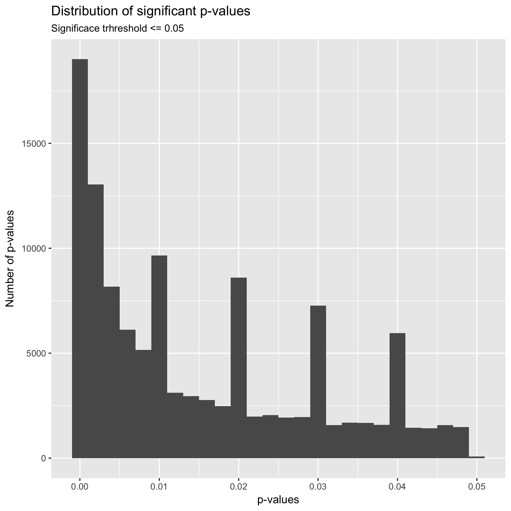
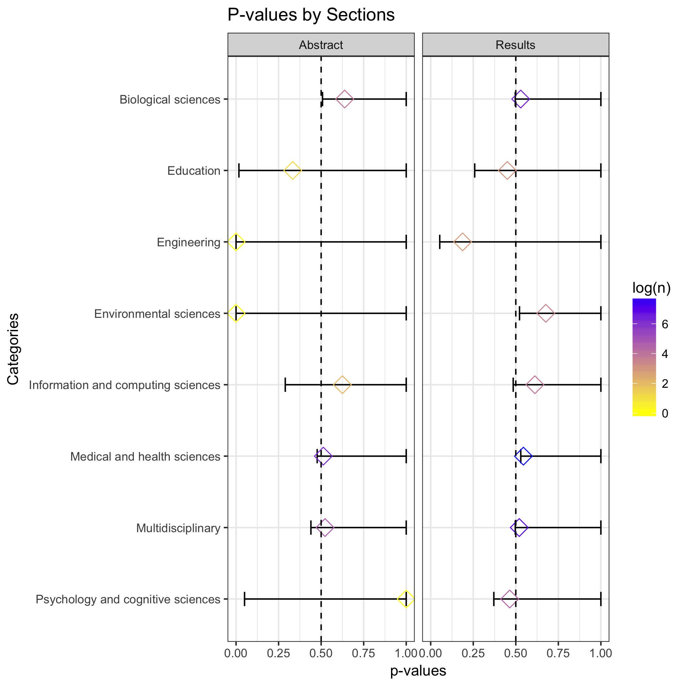

```{r, echo = FALSE}
# libraries
source("./scripts/00_functions.R")
library(knitr)
```

```{r, echo = FALSE}
# Fiting data set for analysis.
p_values_df <- read.csv("./data/processed/tidy_p_values_df_full_set.csv") %>%
  filter((p.value >= 0) & (!is.na(p.value)))
```

## Exploratory analysis. 

I started the analysis exploring the distribution of p-values across all variables. The idea is to check if there is a clustering of p-values around the significance threshold of p = 0.05. The theory of p-curve predicts that naturally occurring p-values are equally distributed. With the exception that in the presence of a effect of the independent variable, the distribution will grow exponentially as it approaches 0.01.     





In the first place, the graph above shows an exponential grow approaching 0.00, winch is expected with studies that are exploring a true effect. In the case of a non-effect, it is expected that the distribution of p-values is equally and project a flat distribution. More interestingly, is the fact that it seems to be clustering of p-values around absolute values such as 0.01, 0.02, 0.03, a 0.04. even when the graph show a distribution of p-values with generally a true effect, it is expected that the distribution of p-values across the plot to be equal. Thus, this clustering near absolute values could be indicative of heave rounding of p-values by researchers, which is an indication of p-hacking. Even when p-hacking research tends to focus in values near p = 0.05, this clustering surrounding absolute p-values represent an interesting phenomenon to explore. 


```{r, echo = FALSE}
#Table
table <- p_values_df %>%
  count(cut_width(p.value, 0.005, boundary = 0))
kable(table, col.names = c("p-values Intervals", "Frequency"), 
      align = "c", 
      caption = "P-values frequency by intervals")
```

In the table above it is possible to see the p-value intervals around which p-values are clustered. For example, we can see that there are significantly more values in the intervals from 0 to 0.005 with 40,221; 0.005 to 0.01	with 19,462; 0.015 to 0.02 with 12827; 0.025 to 0.03	with 10,368; and 0.035 to 0.04 with	8600. It interesting that, in the plot and table above there is not a significant clustering of p-values between the interval 0.04 and 0.05. 


I continued the exploratory analysis examining the distribution of p-values across different categories. However, because the data set has more than 22 categories it was difficult to create a graph avoiding clustering of values. Thus, I selected the more frequent categories and plot those.   


The graph above shows the most frequent categories as Medical and Health Sciences and Multidisciplinary Studies. Similarly, to the distribution of all p-values, the distribution of p-values indicates that the studies explore a true effect phenomenon, that is reaffirming. Furthermore, there is a similar clustering of around absolute p-values independent of the category. Finally, in this plot by categories it is possible to see a small clustering of p-values just bellow p = 0.05. Clustering that was not visible in the graph of all p-values. It is interesting that a similar small clustering of p-values is present between all mayor absolute p-values such as 0.01 and 0.02. Perhaps, that is the true distribution of p-values and the peaks represent p-hacking.


In the context of the public PubMed database, that goes from 1997 to 2014, there has been in significant increase in the number of studies that reported a p-value either in the results section or the abstract. This increase of p-value reporting is particularly strong after 2010. Similarly, it is interesting the sharp decrease of p-value reported after 2013, but this might be related to the number of articles added to the database and not to the number of articles published in PubMed or the number of articles reporting p-values. 


One of the aspect explored by David Chavalarias et al., (2016) is the frequency of p-values reported in both the abstracts and the result section. Similarly to the authors' finding, my exploration finds that most p-values are reported in the body of the articles, in particular in the results section. 


Besides the number of p-values reported, it is clear in the plot that the distribution of p-values reported in abstracts does not significantly differ from the distribution of p-values reported in the result section. The larger among of p-values reported in the result section could be related with the fact that researchers have the tendency of reporting only strong p-values in abstracts while weaker ones are reported in the result section only. 


## Binomial Tests.


```{r, echo=FALSE}
# Performes a binomial test for results section. 
results_df <- p_values_df %>%
  filter((section == "results") & (p.value != "NA") & (p.value < 1))

replications  <- 10

results.bias.test <- bootstrap.binomial.bias.test(results_df, replications)
kable(results.bias.test, 
      align = "c", 
      caption = "Results P-values probability in intervals 0.03 and 0.04", 
      digits = 100, 
      col.names = c("Bins", "Successes", "Trials", "Probabilty"))

```

First I wanted to see the probability of getting a p-value from the result section in the intervals 0 > p <= 0.03 and 0.03 => p <= 0.04. Int the case of the result section, the probability of getting a p-value in the interval 0 > p <= 0.03 is 4.92 percent. Similarly the probability of getting a p-value in the interval 0.03 => p <= 0.04 is 6.50 percent. The probability of getting a p-value in the lower bin (0 to 0.03) is significantly lower than the probability of getting a p-value in the bin closer to the threshold p = 0.05. So, I reject the hypothesize that the frequency of p-values in the bins just bellow the threshold p= 0.05 will be the similar and the frequency of p-values will increasing as the p-value approaches 0.01. This rejection of the hypothesis is an indication of a moderate p-hacking. 


```{r,echo=FALSE}
# Performes a binomial test for abstract section. 
abstracts_df <- p_values_df %>%
  filter((section == "abstract") & (p.value != "NA") & (p.value < 1))

abstracts.bias.test <- bootstrap.binomial.bias.test(abstracts_df, replications)
kable(abstracts.bias.test, 
      align = "c", 
      caption = "Results P-values probability in intervals 0.03 and 0.04",
      digits = 100, 
      col.names = c("Bins", "Successes", "Trials", "Probabilty"))
```

Int the case of the abstract section, the probability of getting a p-value in the intervals 0 > p <= 0.03 and 0.03 => p <= 0.04 is 1.79 and 3.33 respectively. Thus, similarly I reject the hypothesis. Concluding that the test shows p-hacking around the threshold of p = 0.05.





Finally, following Head M. et al, (2015), I conducted a binomial test by categories to determine if the p-haling detected in the binomial test across all categories is present in particular categories. The color of the market represent the sample size. 


### Citations 

Head, M. L., Holman, L., Lanfear, R., Kahn, A. T., & Jennions, M. D. (2015). The Extent and Consequences of P-Hacking in Science. PLOS Biology, 13(3), e1002106–15. http://doi.org/10.1371/journal.pbio.1002106

